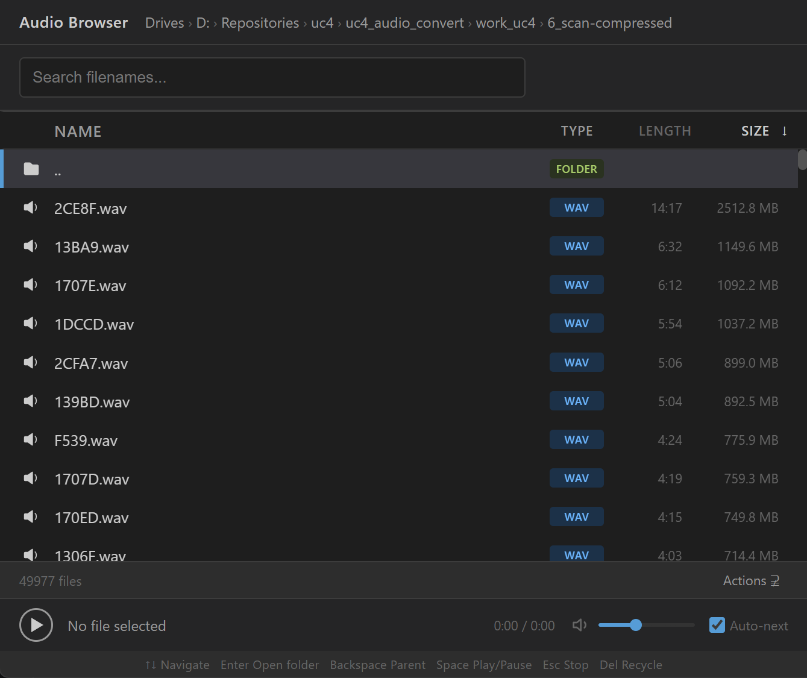

# Audio Browser

An audio file browser designed for quick review of massive folders of audio files.

## Features

- Browse local audio files with support for multiple formats (WAV, MP3, AIFF, FLAC, OGG, M4A, AAC, WMA, OPUS, APE, WV)
- Automatic transcoding for unsupported formats using FFmpeg
- Fast directory listing with pagination for very large folders
- Real-time search functionality to find files quickly
- Sorting by name, size, or file type
- Built-in audio player with auto-play next feature
- Keyboard shortcuts for efficient navigation
- Context menu for some basic file operations
- Convert all to WAV
- Normalize all (normalizes peak volume across all files)

## Getting Started

### Prerequisites

- FFmpeg (optional, required for transcoding AIFF, WMA, APE, and WV files)

## Supported Audio Formats

- **Direct playback**: WAV, MP3, FLAC, OGG, M4A, AAC, OPUS
- **Transcoded playback** (requires FFmpeg): AIFF, WMA, APE, WV

## Development

- `npm start`: Start the production server
- `npm run dev`: Start the development server with auto-reload

## License

This project is licensed under the MIT License.